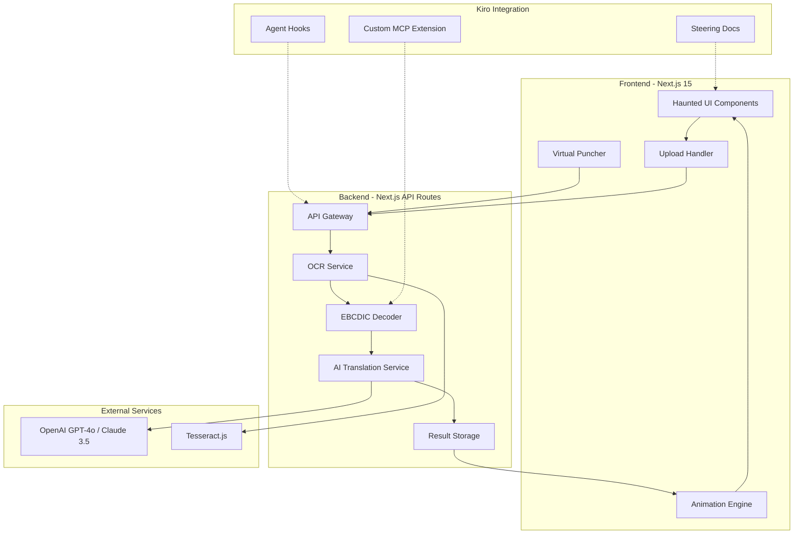
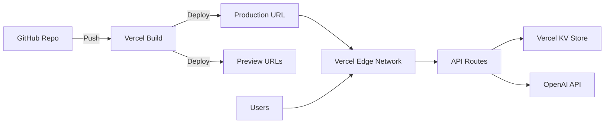

# Design Document

## Overview

PunchRevive is a full-stack web application that resurrects vintage punch card code into modern programming languages. The system combines computer vision, legacy encoding translation, and AI-powered code modernization within an immersive 1960s horror laboratory aesthetic. The architecture emphasizes modularity, testability, and showcase of Kiro IDE's advanced features including spec-driven development, agent hooks, steering documents, and custom MCP extensions.

The application flow: User uploads punch card image → OCR detects holes → EBCDIC decoder translates to source → AI translates to modern language + fixes bugs → Animated resurrection sequence → Downloadable certificate + shareable link.

## Architecture

### High-Level Architecture



### Technology Stack

**Frontend:**
- Next.js 15 (App Router) - React framework with server components
- Tailwind CSS - Utility-first styling with custom haunted theme
- Framer Motion - Animation library for resurrection sequence
- Howler.js - Audio playback for ghost moans and sound effects
- React Dropzone - Drag-and-drop file upload
- HTML5 Canvas - Virtual Puncher grid rendering

**Backend:**
- Next.js API Routes - Serverless functions
- Node.js runtime
- Sharp - Image pre-processing for OCR
- Tesseract.js - OCR engine for hole detection

**AI & Translation:**
- OpenAI GPT-4o API (primary) - Code translation and bug fixing
- Claude 3.5 Sonnet API (fallback) - Alternative LLM provider
- Custom prompt engineering for legacy language understanding

**Deployment:**
- Vercel - Hosting and CI/CD
- Vercel KV - Result storage for shareable links
- GitHub - Version control with public .kiro directory

**Kiro Integration:**
- Custom MCP Server - punch-card-mcp for EBCDIC operations
- Agent Hooks - Pre-commit and post-upload automation
- Steering Documents - Aesthetic and tone enforcement

### Deployment Architecture



## Components and Interfaces

### Frontend Components

#### 1. HauntedLayout Component
**Purpose:** Provides the haunted laboratory background and theme wrapper for all pages.

**Props:**
```typescript
interface HauntedLayoutProps {
  children: React.ReactNode;
  showCobwebs?: boolean;
  glowIntensity?: 'low' | 'medium' | 'high';
}
```

**Responsibilities:**
- Render haunted laboratory background with CRTs, cobwebs, papers
- Apply global color palette (#000000, #0f0, #003300)
- Manage ambient sound effects
- Provide responsive layout container

#### 2. UploadZone Component
**Purpose:** Handles drag-and-drop and camera capture for punch card images.

**Props:**
```typescript
interface UploadZoneProps {
  onUpload: (file: File) => Promise<void>;
  acceptedFormats: string[];
  maxSizeMB: number;
}
```

**Responsibilities:**
- Detect drag-and-drop events with visual feedback
- Validate file types (PNG, JPEG, WEBP)
- Trigger camera on mobile devices
- Display upload progress with spooky animations

#### 3. VirtualPuncher Component
**Purpose:** Interactive 80×12 punch card editor.

**Props:**
```typescript
interface VirtualPuncherProps {
  onSubmit: (punchPattern: boolean[][]) => void;
  initialPattern?: boolean[][];
}
```

**State:**
```typescript
interface VirtualPuncherState {
  grid: boolean[][]; // 12 rows × 80 columns
  selectedColumn: number | null;
  easterEggTriggered: boolean;
}
```

**Responsibilities:**
- Render 80-column × 12-row interactive grid
- Toggle punch holes on click/touch
- Detect "666" pattern for easter egg
- Export punch pattern as boolean array
- Provide visual feedback for punched holes

#### 4. ResurrectionAnimation Component
**Purpose:** Animated sequence showing code coming back to life.

**Props:**
```typescript
interface ResurrectionAnimationProps {
  punchCardImage: string;
  translatedCode: string;
  onComplete: () => void;
}
```

**Animation Sequence:**
1. Lightning strikes (0-1s) - Framer Motion path animation
2. Card shaking (1-2s) - Transform translate with random offsets
3. Ectoplasm glow (2-3s) - Radial gradient expansion
4. Code materialization (3-4s) - Character-by-character reveal
5. Ghost moan sound (throughout) - Howler.js audio

**Responsibilities:**
- Orchestrate multi-stage animation timeline
- Sync visual effects with audio
- Trigger completion callback
- Provide skip option for impatient users

#### 5. CodeDisplay Component
**Purpose:** Shows original and translated code in retro terminal style.

**Props:**
```typescript
interface CodeDisplayProps {
  originalCode: string;
  originalLanguage: 'FORTRAN' | 'COBOL' | 'ASSEMBLER' | 'BASIC';
  translatedCode: string;
  targetLanguage: 'Python' | 'JavaScript';
  exorcismReport: BugFix[];
}
```

**Responsibilities:**
- Render code in IBM Plex Mono with #0f0 color
- Provide syntax highlighting for modern languages
- Display side-by-side comparison
- Show line numbers in retro style
- Animate code reveal with CRT flicker effect

#### 6. ExorcismReport Component
**Purpose:** Displays bugs found and fixed with spooky terminology.

**Props:**
```typescript
interface ExorcismReportProps {
  fixes: BugFix[];
}

interface BugFix {
  type: 'infinite_loop' | 'memory_leak' | 'syntax_error' | 'undefined_variable' | 'type_mismatch';
  location: { line: number; column: number };
  description: string;
  spookyMessage: string; // e.g., "Infinite loop demon banished"
}
```

**Responsibilities:**
- Map technical bug types to horror terminology
- Display fixes in blood-drip styled list
- Animate each fix reveal with ghost effect
- Show "No demons detected" when clean

#### 7. CertificateGenerator Component
**Purpose:** Creates downloadable resurrection certificate.

**Props:**
```typescript
interface CertificateGeneratorProps {
  originalLanguage: string;
  targetLanguage: string;
  resurrectionDate: Date;
  cardId: string;
}
```

**Responsibilities:**
- Render certificate with blood-drip font (Creepster)
- Include decorative horror elements (skulls, cobwebs)
- Generate PNG using html-to-image library
- Trigger browser download
- Display preview before download

#### 8. ShareButton Component
**Purpose:** Generates shareable links and social media cards.

**Props:**
```typescript
interface ShareButtonProps {
  resultId: string;
  punchCardPreview: string;
  codeSnippet: string;
}
```

**Responsibilities:**
- Generate unique shareable URL
- Create Twitter/X preview card with Open Graph tags
- Copy link to clipboard with spooky confirmation
- Display share options (Twitter, Facebook, LinkedIn, Copy)

### Backend Services

#### 1. OCR Service
**File:** `src/services/ocr.service.ts`

**Interface:**
```typescript
interface OCRService {
  detectHoles(imageBuffer: Buffer): Promise<PunchPattern>;
  preprocessImage(imageBuffer: Buffer): Promise<Buffer>;
  calculateConfidence(pattern: PunchPattern): number;
}

interface PunchPattern {
  grid: boolean[][]; // 12 rows × 80 columns
  confidence: number; // 0-1
  metadata: {
    imageWidth: number;
    imageHeight: number;
    detectedColumns: number;
  };
}
```

**Algorithm:**
1. **Pre-processing:**
   - Convert to grayscale using Sharp
   - Apply adaptive thresholding
   - Detect card boundaries using edge detection
   - Perspective correction if card is skewed
   - Normalize to standard punch card dimensions

2. **Hole Detection:**
   - Divide image into 12×80 grid
   - For each cell, calculate average darkness
   - Threshold: darkness > 0.7 = hole present
   - Apply morphological operations to clean noise
   - Validate column alignment

3. **Confidence Calculation:**
   - Check for consistent column spacing
   - Verify row alignment
   - Detect partial holes (reduce confidence)
   - Return confidence score 0-1

**Dependencies:**
- Sharp for image manipulation
- Tesseract.js for OCR fallback on text regions
- Custom computer vision algorithms for hole detection

#### 2. EBCDIC Decoder Service
**File:** `src/services/ebcdic.service.ts`

**Interface:**
```typescript
interface EBCDICService {
  decode(pattern: PunchPattern, encoding: 'IBM029' | 'IBM026'): DecodedCard;
  detectLanguage(sourceCode: string): LegacyLanguage;
  autoDetectEncoding(pattern: PunchPattern): 'IBM029' | 'IBM026';
}

interface DecodedCard {
  sourceCode: string;
  language: LegacyLanguage;
  encoding: 'IBM029' | 'IBM026';
  confidence: number;
}

type LegacyLanguage = 'FORTRAN' | 'COBOL' | 'ASSEMBLER' | 'BASIC' | 'UNKNOWN';
```

**IBM 029 Encoding Map:**
```typescript
const IBM029_MAP: Record<string, string> = {
  '12-0': 'A', '12-1': 'B', '12-2': 'C', // ... full mapping
  '11-0': 'J', '11-1': 'K', // ...
  '0-1': '/', '0-2': 'S', // ...
  // 256 possible combinations mapped to characters
};
```

**Language Detection Heuristics:**
- FORTRAN: Keywords like PROGRAM, SUBROUTINE, DO, FORMAT, column-based structure
- COBOL: Keywords like IDENTIFICATION DIVISION, PROCEDURE DIVISION, PERFORM
- ASSEMBLER: Mnemonics like MOV, ADD, JMP, register names
- BASIC: Line numbers, PRINT, GOTO, INPUT keywords

**Responsibilities:**
- Map 12-bit punch patterns to characters
- Support both IBM 029 and 026 encodings
- Auto-detect encoding by trying both and scoring coherence
- Identify source language from keywords and structure
- Handle special characters and control codes

#### 3. AI Translation Service
**File:** `src/services/translation.service.ts`

**Interface:**
```typescript
interface TranslationService {
  translate(sourceCode: string, sourceLang: LegacyLanguage, targetLang: 'Python' | 'JavaScript'): Promise<TranslationResult>;
  detectBugs(sourceCode: string): Promise<BugFix[]>;
  fixBugs(code: string, bugs: BugFix[]): Promise<string>;
}

interface TranslationResult {
  translatedCode: string;
  bugs: BugFix[];
  exorcismReport: string;
  confidence: number;
}
```

**LLM Prompt Strategy:**

**System Prompt:**
```
You are a code archaeologist specializing in resurrecting dead code from vintage punch cards. 
Your task is to translate legacy code to modern languages while preserving original logic.

Rules:
1. Translate {sourceLang} to {targetLang}
2. Modernize syntax but preserve algorithm
3. Fix bugs: infinite loops, memory leaks, undefined variables, type errors
4. Add minimal comments explaining archaic constructs
5. Ensure output is syntactically valid and runnable
6. Return JSON: {translatedCode, bugs: [{type, line, description}]}
```

**User Prompt Template:**
```
Translate this {sourceLang} code to {targetLang}:

```{sourceCode}```

Detect and fix all bugs. Return JSON with translatedCode and bugs array.
```

**Bug Detection Patterns:**
- Infinite loops: Missing loop termination, off-by-one errors
- Memory leaks: Unclosed file handles, unreleased resources
- Syntax errors: Invalid operators, missing delimiters
- Undefined variables: References before declaration
- Type mismatches: String/number confusion

**Responsibilities:**
- Call OpenAI GPT-4o API (or Claude fallback)
- Parse LLM response into structured format
- Validate translated code syntax
- Generate spooky bug descriptions
- Handle API errors gracefully

#### 4. Result Storage Service
**File:** `src/services/storage.service.ts`

**Interface:**
```typescript
interface StorageService {
  saveResult(result: ResurrectionResult): Promise<string>; // Returns unique ID
  getResult(id: string): Promise<ResurrectionResult | null>;
  generateShareableLink(id: string): string;
}

interface ResurrectionResult {
  id: string;
  punchCardImage: string; // Base64 or URL
  originalCode: string;
  originalLanguage: LegacyLanguage;
  translatedCode: string;
  targetLanguage: 'Python' | 'JavaScript';
  bugs: BugFix[];
  timestamp: Date;
}
```

**Storage Backend:**
- Vercel KV (Redis) for fast key-value storage
- TTL: 30 days for shareable results
- Key format: `resurrection:{uuid}`

**Responsibilities:**
- Generate unique IDs for results
- Store resurrection data in Vercel KV
- Retrieve results for shareable links
- Handle expiration and cleanup

### API Routes

#### POST /api/upload
**Purpose:** Handle punch card image upload and initiate processing.

**Request:**
```typescript
{
  image: File | string; // File object or base64
  source: 'upload' | 'camera' | 'virtual';
}
```

**Response:**
```typescript
{
  success: boolean;
  jobId: string;
  message: string;
}
```

**Flow:**
1. Validate image format and size
2. Store image temporarily
3. Trigger OCR processing
4. Return job ID for polling

#### GET /api/process/:jobId
**Purpose:** Poll processing status and retrieve results.

**Response:**
```typescript
{
  status: 'processing' | 'complete' | 'error';
  progress: number; // 0-100
  result?: ResurrectionResult;
  error?: string;
}
```

#### POST /api/translate
**Purpose:** Translate decoded source code to modern language.

**Request:**
```typescript
{
  sourceCode: string;
  sourceLang: LegacyLanguage;
  targetLang: 'Python' | 'JavaScript';
}
```

**Response:**
```typescript
{
  translatedCode: string;
  bugs: BugFix[];
  exorcismReport: string;
}
```

#### GET /api/share/:id
**Purpose:** Retrieve shared resurrection result.

**Response:**
```typescript
{
  result: ResurrectionResult;
  metadata: {
    views: number;
    createdAt: Date;
  };
}
```

## Data Models

### PunchCard Model
```typescript
interface PunchCard {
  id: string;
  source: 'upload' | 'camera' | 'virtual';
  imageUrl?: string;
  pattern: boolean[][]; // 12×80 grid
  confidence: number;
  createdAt: Date;
}
```

### DecodedSource Model
```typescript
interface DecodedSource {
  cardId: string;
  sourceCode: string;
  language: LegacyLanguage;
  encoding: 'IBM029' | 'IBM026';
  confidence: number;
  decodedAt: Date;
}
```

### Translation Model
```typescript
interface Translation {
  sourceId: string;
  translatedCode: string;
  targetLanguage: 'Python' | 'JavaScript';
  bugs: BugFix[];
  confidence: number;
  translatedAt: Date;
}
```

### BugFix Model
```typescript
interface BugFix {
  id: string;
  type: 'infinite_loop' | 'memory_leak' | 'syntax_error' | 'undefined_variable' | 'type_mismatch';
  severity: 'critical' | 'warning' | 'info';
  location: {
    line: number;
    column: number;
    snippet: string;
  };
  description: string;
  spookyMessage: string;
  fix: string;
}
```

### ShareableResult Model
```typescript
interface ShareableResult {
  id: string;
  punchCard: PunchCard;
  decodedSource: DecodedSource;
  translation: Translation;
  certificateUrl: string;
  shareUrl: string;
  views: number;
  createdAt: Date;
  expiresAt: Date;
}
```

## Correctness Properties

*A property is a characteristic or behavior that should hold true across all valid executions of a system—essentially, a formal statement about what the system should do. Properties serve as the bridge between human-readable specifications and machine-verifiable correctness guarantees.*


### Property Reflection

After analyzing all acceptance criteria, I've identified several areas where properties can be consolidated to eliminate redundancy:

**Consolidation Opportunities:**
1. **File format validation (1.3, 1.5)**: These test opposite sides of the same validation logic - accepting valid formats and rejecting invalid ones. Can be combined into a single comprehensive property about file format validation.

2. **EBCDIC encoding (4.1, 4.2)**: Both test decoding with different encoding standards. Can be combined into a single property that tests decoding works correctly for both IBM 029 and IBM 026.

3. **Translation to modern languages (5.1, 5.2)**: Both test translation capability to different target languages. Can be combined into a single property that tests translation works for both Python and JavaScript.

4. **Responsive layout (16.1, 16.2, 16.3)**: All three test responsive behavior at different viewport sizes. Can be combined into a single property about responsive layout adaptation.

5. **Touch target sizes (16.4, 16.5)**: Both test minimum touch target requirements. 16.5 is more comprehensive and subsumes 16.4.

**Properties to Keep:**
- OCR accuracy and grid output properties (3.1, 3.3, 3.5) provide unique validation at different stages
- Bug detection and fixing properties (6.1, 6.2) test different aspects of the bug handling pipeline
- UI behavior properties (2.2, 2.3, 8.2, 8.3, 8.4) each test distinct visual/interaction aspects

### Core Correctness Properties

**Property 1: File format validation**
*For any* uploaded file, the system should accept PNG, JPEG, and WEBP formats and reject all other formats with an error message.
**Validates: Requirements 1.3, 1.5**

**Property 2: Virtual Puncher toggle behavior**
*For any* grid position in the 80×12 Virtual Puncher, clicking that position should toggle the punch hole state between punched and unpunched.
**Validates: Requirements 2.2**

**Property 3: Virtual Puncher visual consistency**
*For any* punch pattern in the Virtual Puncher, all punched positions should be visually represented as filled circles and unpunched positions as empty.
**Validates: Requirements 2.3**

**Property 4: OCR accuracy threshold**
*For any* real punch card image with clear lighting and focus, the OCR Engine should detect punch hole positions with at least 95% accuracy.
**Validates: Requirements 3.1**

**Property 5: OCR pre-processing application**
*For any* punch card image with poor lighting or blur, the OCR Engine should apply pre-processing transformations before hole detection.
**Validates: Requirements 3.2**

**Property 6: OCR grid output format**
*For any* processed punch card image, the OCR Engine should output a 12×80 boolean grid representing detected punch positions.
**Validates: Requirements 3.3**

**Property 7: OCR confidence error handling**
*For any* punch card image where confidence is below 95%, the system should notify the user and request a clearer image rather than proceeding with unreliable data.
**Validates: Requirements 3.4**

**Property 8: Virtual card perfect accuracy**
*For any* virtual punch card created in the Virtual Puncher, the OCR Engine should achieve 100% accuracy in reconstructing the punch pattern.
**Validates: Requirements 3.5**

**Property 9: EBCDIC decoding correctness**
*For any* valid punch pattern, the EBCDIC Decoder should correctly translate it to characters using both IBM 029 and IBM 026 encoding standards.
**Validates: Requirements 4.1, 4.2**

**Property 10: Language detection accuracy**
*For any* decoded source code containing language-specific keywords, the EBCDIC Decoder should correctly identify the language as FORTRAN, COBOL, Assembler, or BASIC.
**Validates: Requirements 4.3**

**Property 11: Ambiguous pattern fallback**
*For any* ambiguous punch pattern, the EBCDIC Decoder should attempt decoding with both IBM 029 and IBM 026 standards and select the result with higher coherence score.
**Validates: Requirements 4.4**

**Property 12: Translation to modern languages**
*For any* valid legacy source code, the AI Translator should produce syntactically valid output in both Python 3 and JavaScript ES2025.
**Validates: Requirements 5.1, 5.2, 5.3**

**Property 13: Bug detection completeness**
*For any* legacy code containing infinite loops, memory leaks, syntax errors, undefined variables, or type mismatches, the AI Translator should detect and report all such bugs.
**Validates: Requirements 6.1**

**Property 14: Bug fixing application**
*For any* detected bugs in legacy code, the AI Translator should produce translated output where those bugs are fixed and no longer present.
**Validates: Requirements 6.2**

**Property 15: Exorcism Report generation**
*For any* translation with detected bugs, the system should generate an Exorcism Report containing an entry for each bug fix.
**Validates: Requirements 6.3**

**Property 16: Spooky terminology usage**
*For any* Exorcism Report with bug fixes, the report should use horror-themed terminology such as "demon", "vampire", "banished", or "staked" in bug descriptions.
**Validates: Requirements 6.4**

**Property 17: Color palette consistency**
*For any* UI element in the application, the computed colors should only use the haunted laboratory palette: #000000 (black), #0f0 (toxic green), or #003300 (dark green).
**Validates: Requirements 8.2**

**Property 18: Code font styling**
*For any* code or technical text display, the system should use IBM Plex Mono font with green (#0f0) color.
**Validates: Requirements 8.3**

**Property 19: Heading font styling**
*For any* heading or title element, the system should use Creepster font for horror aesthetic.
**Validates: Requirements 8.4**

**Property 20: Responsive theme preservation**
*For any* viewport width from 320px (mobile) to 1920px (desktop), the haunted laboratory theme elements should remain visible and properly styled.
**Validates: Requirements 8.5**

**Property 21: Certificate content completeness**
*For any* generated Certificate of Resurrection, it should include the original language, target language, and resurrection date fields.
**Validates: Requirements 9.3**

**Property 22: Shareable URL uniqueness**
*For any* two different resurrection results, the generated shareable URLs should be unique with no collisions.
**Validates: Requirements 10.1**

**Property 23: Shared result content completeness**
*For any* shareable URL accessed, the page should display the original punch card, translated code, and Exorcism Report.
**Validates: Requirements 10.2**

**Property 24: Shared result mobile responsiveness**
*For any* shareable URL accessed on mobile viewport (≤768px width), the content should display in a mobile-optimized responsive layout.
**Validates: Requirements 10.5**

**Property 25: Responsive layout adaptation**
*For any* viewport width, the application layout should adapt appropriately: mobile layout for ≤768px, tablet layout for 769-1024px, and desktop layout for >1024px.
**Validates: Requirements 16.1, 16.2, 16.3**

**Property 26: Touch target minimum size**
*For any* interactive element (button, link, input) on mobile viewport, the touch target should be at least 44×44 pixels.
**Validates: Requirements 16.4, 16.5**

## Error Handling

### Error Categories

**1. Upload Errors**
- Invalid file format → "This ancient artifact must be a PNG, JPEG, or WEBP image"
- File too large (>10MB) → "This tome is too massive for resurrection (max 10MB)"
- Network failure → "The spirits are restless - connection lost"

**2. OCR Errors**
- Low confidence (<95%) → "The card is too faded to read clearly - try better lighting"
- No card detected → "No punch card detected in this image"
- Processing timeout → "The resurrection ritual is taking too long - please try again"

**3. Decoding Errors**
- Invalid punch pattern → "This pattern doesn't match known EBCDIC encodings"
- Unrecognized language → "The ancient language is unknown to us"
- Empty card → "This card contains no punches - nothing to resurrect"

**4. Translation Errors**
- LLM API failure → "The AI spirits are unavailable - please try again"
- Rate limit exceeded → "Too many resurrections - the spirits need rest"
- Invalid source code → "The source code is too corrupted to translate"

**5. Storage Errors**
- Save failure → "Failed to preserve the resurrection for sharing"
- Result not found → "This resurrection has faded into the void (expired or invalid ID)"

### Error Handling Strategy

**User-Facing Errors:**
- All error messages use spooky/horror terminology consistent with theme
- Provide actionable guidance (e.g., "try better lighting" not just "error")
- Display errors in blood-red text with ghost icon
- Include "Try Again" button with shake animation

**Technical Errors:**
- Log detailed errors to console for debugging
- Include error codes for support (e.g., OCR_001, TRANS_042)
- Implement exponential backoff for API retries
- Graceful degradation (e.g., show partial results if translation fails)

**Validation:**
- Client-side validation before API calls to reduce errors
- Server-side validation as final gate
- Clear validation messages during input (e.g., "File must be an image")

## Testing Strategy

### Unit Testing

**Framework:** Vitest with React Testing Library

**Unit Test Coverage:**

1. **Component Tests:**
   - VirtualPuncher: Toggle behavior, grid rendering, pattern export
   - UploadZone: File validation, drag-and-drop events, camera trigger
   - CodeDisplay: Syntax highlighting, line numbers, side-by-side layout
   - ExorcismReport: Bug list rendering, spooky message mapping
   - CertificateGenerator: PNG generation, content inclusion

2. **Service Tests:**
   - OCR Service: Image pre-processing, hole detection algorithm, confidence calculation
   - EBCDIC Decoder: Character mapping for IBM 029/026, language detection heuristics
   - Translation Service: LLM prompt construction, response parsing, bug detection patterns
   - Storage Service: ID generation, KV operations, URL construction

3. **Utility Tests:**
   - Image processing utilities: Grayscale conversion, thresholding, edge detection
   - Validation utilities: File type checking, size limits, pattern validation
   - Formatting utilities: Code formatting, date formatting, spooky message generation

**Example Unit Tests:**
```typescript
// Virtual Puncher toggle test
test('clicking a grid cell toggles punch hole state', () => {
  const { getByTestId } = render(<VirtualPuncher />);
  const cell = getByTestId('cell-0-0');
  
  expect(cell).not.toHaveClass('punched');
  fireEvent.click(cell);
  expect(cell).toHaveClass('punched');
  fireEvent.click(cell);
  expect(cell).not.toHaveClass('punched');
});

// File validation test
test('rejects non-image files', () => {
  const file = new File(['content'], 'test.txt', { type: 'text/plain' });
  expect(validateFileType(file)).toBe(false);
});

// EBCDIC decoding test
test('decodes IBM 029 pattern correctly', () => {
  const pattern = [[true, false, ...], ...]; // Pattern for 'A'
  expect(decodeEBCDIC(pattern, 'IBM029')).toBe('A');
});
```

### Property-Based Testing

**Framework:** fast-check (JavaScript property-based testing library)

**Configuration:**
- Minimum 100 iterations per property test
- Seed-based reproducibility for failed tests
- Shrinking enabled to find minimal failing examples

**Property Test Implementation:**

Each property test MUST be tagged with a comment referencing the design document property:

```typescript
// **Feature: punch-revive, Property 1: File format validation**
test('accepts valid image formats and rejects invalid formats', () => {
  fc.assert(
    fc.property(
      fc.oneof(
        fc.constant('image/png'),
        fc.constant('image/jpeg'),
        fc.constant('image/webp'),
        fc.string().filter(s => !['image/png', 'image/jpeg', 'image/webp'].includes(s))
      ),
      (mimeType) => {
        const file = new File([''], 'test', { type: mimeType });
        const isValid = ['image/png', 'image/jpeg', 'image/webp'].includes(mimeType);
        expect(validateFileType(file)).toBe(isValid);
      }
    ),
    { numRuns: 100 }
  );
});

// **Feature: punch-revive, Property 2: Virtual Puncher toggle behavior**
test('toggling any grid position twice returns to original state', () => {
  fc.assert(
    fc.property(
      fc.integer({ min: 0, max: 11 }), // row
      fc.integer({ min: 0, max: 79 }), // column
      (row, col) => {
        const puncher = new VirtualPuncherModel();
        const initialState = puncher.getCell(row, col);
        
        puncher.toggleCell(row, col);
        puncher.toggleCell(row, col);
        
        expect(puncher.getCell(row, col)).toBe(initialState);
      }
    ),
    { numRuns: 100 }
  );
});

// **Feature: punch-revive, Property 8: Virtual card perfect accuracy**
test('OCR achieves 100% accuracy on virtual cards', () => {
  fc.assert(
    fc.property(
      fc.array(fc.array(fc.boolean(), { minLength: 80, maxLength: 80 }), { minLength: 12, maxLength: 12 }),
      async (pattern) => {
        const virtualCard = generateVirtualCardImage(pattern);
        const detected = await ocrService.detectHoles(virtualCard);
        
        expect(detected.grid).toEqual(pattern);
        expect(detected.confidence).toBe(1.0);
      }
    ),
    { numRuns: 100 }
  );
});

// **Feature: punch-revive, Property 12: Translation to modern languages**
test('translation produces syntactically valid code', () => {
  fc.assert(
    fc.property(
      fc.oneof(
        generateFortranCode(),
        generateCobolCode(),
        generateBasicCode()
      ),
      fc.constantFrom('Python', 'JavaScript'),
      async (sourceCode, targetLang) => {
        const result = await translationService.translate(sourceCode, targetLang);
        
        // Validate syntax by parsing
        if (targetLang === 'Python') {
          expect(() => parsePython(result.translatedCode)).not.toThrow();
        } else {
          expect(() => parseJavaScript(result.translatedCode)).not.toThrow();
        }
      }
    ),
    { numRuns: 100 }
  );
});

// **Feature: punch-revive, Property 17: Color palette consistency**
test('all UI elements use only haunted laboratory colors', () => {
  fc.assert(
    fc.property(
      fc.constantFrom('button', 'div', 'span', 'h1', 'p'),
      (elementType) => {
        const element = document.createElement(elementType);
        element.className = 'haunted-ui';
        document.body.appendChild(element);
        
        const computedStyle = window.getComputedStyle(element);
        const color = computedStyle.color;
        const backgroundColor = computedStyle.backgroundColor;
        
        const validColors = ['rgb(0, 0, 0)', 'rgb(0, 255, 0)', 'rgb(0, 51, 0)'];
        expect(validColors).toContain(color);
        expect(validColors).toContain(backgroundColor);
        
        document.body.removeChild(element);
      }
    ),
    { numRuns: 100 }
  );
});

// **Feature: punch-revive, Property 22: Shareable URL uniqueness**
test('different results generate unique shareable URLs', () => {
  fc.assert(
    fc.property(
      fc.array(generateResurrectionResult(), { minLength: 2, maxLength: 100 }),
      async (results) => {
        const urls = await Promise.all(
          results.map(r => storageService.saveResult(r))
        );
        
        const uniqueUrls = new Set(urls);
        expect(uniqueUrls.size).toBe(urls.length); // No collisions
      }
    ),
    { numRuns: 100 }
  );
});

// **Feature: punch-revive, Property 26: Touch target minimum size**
test('all interactive elements meet 44x44px minimum on mobile', () => {
  fc.assert(
    fc.property(
      fc.constantFrom('button', 'a', 'input'),
      (elementType) => {
        // Set mobile viewport
        Object.defineProperty(window, 'innerWidth', { value: 375, writable: true });
        
        const element = document.createElement(elementType);
        element.className = 'interactive';
        document.body.appendChild(element);
        
        const rect = element.getBoundingClientRect();
        expect(rect.width).toBeGreaterThanOrEqual(44);
        expect(rect.height).toBeGreaterThanOrEqual(44);
        
        document.body.removeChild(element);
      }
    ),
    { numRuns: 100 }
  );
});
```

**Custom Generators:**

```typescript
// Generator for valid FORTRAN code
const generateFortranCode = () => fc.string().map(s => `
  PROGRAM HELLO
    PRINT *, '${s}'
  END PROGRAM HELLO
`);

// Generator for punch patterns
const generatePunchPattern = () => 
  fc.array(
    fc.array(fc.boolean(), { minLength: 80, maxLength: 80 }),
    { minLength: 12, maxLength: 12 }
  );

// Generator for resurrection results
const generateResurrectionResult = () => fc.record({
  id: fc.uuid(),
  originalCode: fc.string(),
  translatedCode: fc.string(),
  timestamp: fc.date()
});
```

### Integration Testing

**Scope:** End-to-end flows without external API calls (mocked)

**Test Scenarios:**
1. Upload → OCR → Decode → Translate → Display (happy path)
2. Virtual Puncher → Submit → Decode → Translate → Certificate
3. Share link generation → Retrieval → Display
4. Error handling at each stage

**Tools:**
- Playwright for browser automation
- MSW (Mock Service Worker) for API mocking

### End-to-End Testing

**Scope:** Full user journeys with real external services (staging environment)

**Critical Paths:**
1. Real punch card photo upload and resurrection
2. Virtual card creation and processing
3. Social sharing and link access
4. Mobile responsive experience

**Tools:**
- Playwright with real browser instances
- Visual regression testing with Percy or Chromatic

### Performance Testing

**Metrics:**
- OCR processing time: <3 seconds for standard image
- Translation time: <5 seconds for typical card
- Page load time: <2 seconds (Lighthouse score >90)
- Animation frame rate: 60fps for resurrection sequence

**Tools:**
- Lighthouse CI for performance budgets
- Chrome DevTools Performance profiler

## Kiro Integration Details

### Custom MCP Extension: punch-card-mcp

**Purpose:** Extend Kiro IDE with native punch card operations

**Location:** `.kiro/mcp/punch-card-mcp/`

**Capabilities:**

1. **ebcdic_decode**
   - Input: Punch pattern (12×80 boolean array), encoding ('IBM029' | 'IBM026')
   - Output: Decoded string
   - Usage: Decode punch patterns directly in Kiro

2. **legacy_translate**
   - Input: Source code, source language, target language
   - Output: Translated code
   - Usage: Translate legacy code snippets in editor

3. **validate_punch_pattern**
   - Input: Punch pattern
   - Output: Validation result with errors
   - Usage: Validate punch card patterns before processing

**MCP Server Implementation:**
```typescript
// .kiro/mcp/punch-card-mcp/server.ts
import { MCPServer } from '@kiro/mcp-sdk';

const server = new MCPServer({
  name: 'punch-card-mcp',
  version: '1.0.0',
  capabilities: ['ebcdic_decode', 'legacy_translate', 'validate_punch_pattern']
});

server.registerTool('ebcdic_decode', async (params) => {
  const { pattern, encoding } = params;
  return ebcdicDecoder.decode(pattern, encoding);
});

server.registerTool('legacy_translate', async (params) => {
  const { sourceCode, sourceLang, targetLang } = params;
  return translationService.translate(sourceCode, sourceLang, targetLang);
});

server.registerTool('validate_punch_pattern', async (params) => {
  const { pattern } = params;
  return validator.validatePattern(pattern);
});

server.start();
```

**Configuration:**
```json
// .kiro/settings/mcp.json
{
  "mcpServers": {
    "punch-card-mcp": {
      "command": "node",
      "args": [".kiro/mcp/punch-card-mcp/server.js"],
      "env": {},
      "disabled": false,
      "autoApprove": ["ebcdic_decode", "validate_punch_pattern"]
    }
  }
}
```

### Agent Hooks

**1. Pre-Commit Hook: Curse Detector**

**Location:** `.kiro/hooks/pre-commit.yaml`

**Purpose:** Run AI-powered linting with spooky feedback before commits

**Configuration:**
```yaml
name: curse-detector
trigger: pre-commit
action: send-message
message: |
  🧛 The Curse Detector awakens...
  
  Analyze the staged files for code quality issues and provide feedback using horror-themed terminology:
  - "Memory leak vampire detected" for memory issues
  - "Infinite loop demon lurking" for potential infinite loops
  - "Undefined variable ghost haunting" for undefined references
  - "Type mismatch zombie shambling" for type errors
  
  If code is clean: "No curses detected - the code is pure ✨"
  
  Staged files: {{staged_files}}
```

**2. Post-Upload Hook: Resurrection Pipeline**

**Location:** `.kiro/hooks/post-upload.yaml`

**Purpose:** Automatically trigger OCR → Decode → Translate pipeline after image upload

**Configuration:**
```yaml
name: resurrection-pipeline
trigger: file-upload
filter: "*.png,*.jpg,*.jpeg,*.webp"
action: execute-command
command: |
  echo "⚡ Initiating resurrection sequence..."
  npm run process-card -- {{uploaded_file}}
```

### Steering Documents

**1. Aesthetic Steering**

**Location:** `.kiro/steering/haunted-aesthetic.md`

**Content:**
```markdown
---
inclusion: always
---

# Haunted Laboratory Aesthetic Guidelines

When generating UI code or content for PunchRevive, ALWAYS follow these rules:

## Color Palette
- Background: #000000 (pure black)
- Primary text/accents: #0f0 (toxic green)
- Secondary: #003300 (dark green)
- NEVER use: bright colors, pastels, warm tones

## Typography
- Code/technical: IBM Plex Mono
- Headings: Creepster (Google Fonts)
- Body: IBM Plex Mono or system monospace

## Tone & Voice
- Use horror/resurrection metaphors
- Examples: "resurrect", "exorcise", "banish demons", "ancient code"
- Avoid: corporate speak, overly technical jargon, cheerful language

## Visual Elements
- Cobwebs, dust, CRT monitors, flickering effects
- Green phosphor glow on text
- Scanline effects on code displays
- Ghost/ectoplasm animations

## Anti-Patterns (NEVER DO)
- ❌ Bright, cheerful colors
- ❌ Modern, clean minimalist design
- ❌ Sans-serif fonts (except Creepster for headings)
- ❌ Smooth, polished animations (use glitchy, CRT-style)
```

**2. Code Generation Steering**

**Location:** `.kiro/steering/code-standards.md`

**Content:**
```markdown
---
inclusion: always
---

# PunchRevive Code Standards

## File Organization
- Components: `src/components/[ComponentName]/[ComponentName].tsx`
- Services: `src/services/[service-name].service.ts`
- Utils: `src/utils/[util-name].ts`
- Types: `src/types/[domain].types.ts`

## Naming Conventions
- Components: PascalCase (e.g., `VirtualPuncher`)
- Files: kebab-case (e.g., `virtual-puncher.tsx`)
- Functions: camelCase (e.g., `detectHoles`)
- Constants: SCREAMING_SNAKE_CASE (e.g., `IBM029_MAP`)

## TypeScript
- ALWAYS use explicit types, no `any`
- Prefer interfaces over types for objects
- Use strict mode
- Document complex types with JSDoc

## Testing
- Co-locate tests: `[component].test.tsx`
- Property tests: Tag with `// **Feature: punch-revive, Property N: ...**`
- Minimum 100 iterations for property tests

## Comments
- Use spooky terminology in user-facing strings
- Technical comments should be clear and professional
- Document WHY, not WHAT
```

## Deployment Strategy

### Vercel Configuration

**File:** `vercel.json`
```json
{
  "buildCommand": "npm run build",
  "outputDirectory": ".next",
  "framework": "nextjs",
  "env": {
    "OPENAI_API_KEY": "@openai-api-key",
    "CLAUDE_API_KEY": "@claude-api-key"
  },
  "regions": ["iad1"],
  "functions": {
    "api/**/*.ts": {
      "maxDuration": 30
    }
  }
}
```

### Environment Variables

**Required:**
- `OPENAI_API_KEY`: OpenAI API key for GPT-4o
- `CLAUDE_API_KEY`: Anthropic API key for Claude 3.5 (fallback)
- `KV_REST_API_URL`: Vercel KV REST API URL
- `KV_REST_API_TOKEN`: Vercel KV REST API token

**Optional:**
- `NEXT_PUBLIC_APP_URL`: Public URL for shareable links
- `SENTRY_DSN`: Error tracking (if implemented)

### CI/CD Pipeline

**GitHub Actions:** `.github/workflows/deploy.yml`
```yaml
name: Deploy to Vercel
on:
  push:
    branches: [main]
  pull_request:
    branches: [main]

jobs:
  deploy:
    runs-on: ubuntu-latest
    steps:
      - uses: actions/checkout@v3
      - uses: actions/setup-node@v3
        with:
          node-version: '18'
      - run: npm ci
      - run: npm run test
      - run: npm run build
      - uses: amondnet/vercel-action@v20
        with:
          vercel-token: ${{ secrets.VERCEL_TOKEN }}
          vercel-org-id: ${{ secrets.VERCEL_ORG_ID }}
          vercel-project-id: ${{ secrets.VERCEL_PROJECT_ID }}
```

### Performance Optimizations

1. **Image Optimization:**
   - Use Next.js Image component for backgrounds
   - Lazy load non-critical images
   - WebP format with fallbacks

2. **Code Splitting:**
   - Dynamic imports for heavy components (VirtualPuncher, ResurrectionAnimation)
   - Route-based splitting via Next.js App Router

3. **Caching:**
   - Static assets: 1 year cache
   - API responses: 5 minutes cache for shareable results
   - Vercel KV for result storage

4. **Bundle Size:**
   - Tree-shake unused code
   - Use lightweight alternatives (e.g., Howler.js instead of Tone.js)
   - Monitor bundle size with @next/bundle-analyzer

## Security Considerations

### Input Validation
- Sanitize all file uploads (check magic bytes, not just extension)
- Limit file size to 10MB
- Validate punch patterns (12×80 dimensions)
- Rate limit API endpoints (10 requests/minute per IP)

### API Security
- Store API keys in environment variables
- Use Vercel Edge Config for secrets
- Implement request signing for internal APIs
- CORS configuration for public API routes

### Data Privacy
- No PII collection
- Shareable results expire after 30 days
- No tracking cookies (analytics via privacy-friendly service)
- Clear data retention policy in README

### XSS Prevention
- Sanitize user-generated content (if any)
- Use React's built-in XSS protection
- CSP headers via Next.js config

## Accessibility

### WCAG 2.1 AA Compliance

**Color Contrast:**
- Green (#0f0) on black (#000) = 13.7:1 ratio ✓
- Dark green (#003300) on black = 1.4:1 ratio ✗ (use only for decorative elements)

**Keyboard Navigation:**
- All interactive elements focusable
- Visible focus indicators (green outline)
- Logical tab order
- Escape key to close modals

**Screen Readers:**
- Semantic HTML (button, nav, main, article)
- ARIA labels for icon buttons
- Alt text for images
- Live regions for dynamic content (resurrection progress)

**Motion:**
- Respect `prefers-reduced-motion`
- Provide "Skip Animation" button
- No auto-playing audio (user must trigger)

## Browser Support

**Target Browsers:**
- Chrome/Edge: Last 2 versions
- Firefox: Last 2 versions
- Safari: Last 2 versions
- Mobile Safari: iOS 14+
- Chrome Mobile: Android 10+

**Progressive Enhancement:**
- Core functionality works without JavaScript (upload form)
- Graceful degradation for older browsers
- Polyfills for missing features (via Next.js)

## Monitoring & Observability

### Metrics to Track
- Upload success rate
- OCR accuracy (average confidence)
- Translation success rate
- API response times
- Error rates by type
- User engagement (resurrections per day)

### Logging Strategy
- Client errors: Console + optional Sentry
- Server errors: Vercel logs + structured logging
- Performance: Web Vitals tracking
- Business metrics: Custom events to analytics

### Alerts
- API error rate >5%
- Average OCR confidence <90%
- Response time >10s
- Deployment failures

## Future Enhancements

**Phase 2 (Post-Hackathon):**
- Batch processing (multiple cards at once)
- OCR training on user-corrected cards
- Support for more legacy languages (APL, PL/I)
- Collaborative card collections
- AR mode for mobile (overlay translation on physical cards)

**Phase 3 (Startup Pivot):**
- Enterprise SaaS for legacy code migration
- Custom training for domain-specific languages
- Integration with version control systems
- Automated test generation for translated code
- Cost estimation for full codebase migration

---

This design document provides a comprehensive blueprint for implementing PunchRevive while showcasing Kiro IDE's advanced capabilities through spec-driven development, agent hooks, steering documents, and custom MCP extensions.
