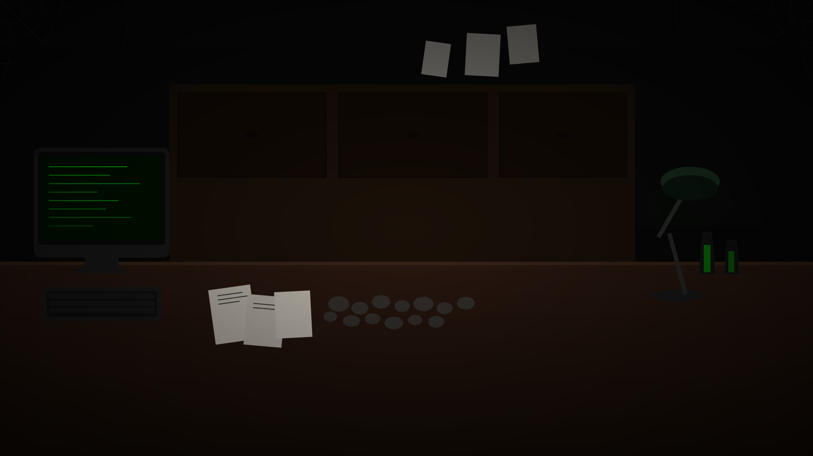

# 🧛 PunchRevive - Resurrect Dead Code from the Crypt

> **Kiroween 2024 Contest Entry** - A haunted laboratory web app that resurrects vintage punch card code into modern programming languages using local AI.



## ⚡ Quick Start

```bash
# Install dependencies
npm install

# Run development server
npm run dev
```

Open [http://localhost:3000](http://localhost:3000) and witness the resurrection ritual!

## 🎃 Features

### 🖼️ Immersive Haunted Laboratory
- **Authentic Background**: Dark wooden desk, vintage CRT monitor, cobwebs, scattered papers, desk lamp, glowing vials
- **Atmospheric Effects**: Lightning flashes, floating dust particles, scanlines, CRT glow
- **Dramatic Intro**: Full-screen animated sequence with pulsing title and floating ghosts

### 📸 Dual Input Modes
- **Upload Photo**: Drag-and-drop with lightning flash effects and ghost moan sounds
- **Virtual Puncher**: Interactive 80×12 grid pre-loaded with "HELLO WORLD!" demo pattern
  - Click cells to punch holes
  - Real-time punch counter
  - Mechanical punch sound effects
  - Load Demo / Clear / Resurrect buttons

### 🔮 Translation Modes
- **Local Mode (No API Required!)**: EBCDIC decoder translates punch patterns instantly
  - Works out of the box with zero setup
  - Perfect for demos and learning
  - Shows decoded text immediately
- **AI Mode (Optional)**: Advanced translation with bug fixing
  - Ollama Llama 3:70b (local, zero-cost)
  - OpenAI GPT-4o, Claude 3.5 Sonnet (cloud fallbacks)
  - OCR detection, bug fixing, code modernization

### 🎨 Haunted Aesthetic
- **Colors**: Pure black (#000), toxic green (#0f0), dark green (#003300)
- **Fonts**: Creepster (headings), IBM Plex Mono (code/body)
- **Effects**: CRT scanlines, phosphor glow, blood drips, ectoplasm animations
- **Tone**: Horror metaphors ("resurrect", "exorcise", "banish demons")

### 👻 Easter Eggs
- Type "666" in the Virtual Puncher for a demonic surprise
- Skull pattern included in demo (column 60+)
- Random lightning flashes every 10-25 seconds

## 🚀 No Setup Required!

PunchRevive works **immediately** without any API keys:

```bash
npm install
npm run dev
```

The Virtual Puncher uses local EBCDIC decoding - no AI needed!

## 🧪 Optional: AI Mode Setup

Want advanced features like bug fixing and code modernization? Add AI:

### Option 1: Ollama (Local, Free)
```bash
# Install Ollama
# Windows: Download from https://ollama.ai
# Mac: brew install ollama
# Linux: curl -fsSL https://ollama.ai/install.sh | sh

# Pull Llama 3 model
ollama pull llama3:70b
```

### Option 2: Cloud APIs
Create `.env.local`:
```bash
# Choose one or more:
OLLAMA_BASE_URL=http://localhost:11434
OLLAMA_MODEL=llama3:70b

OPENAI_API_KEY=sk-...
CLAUDE_API_KEY=sk-ant-...
```

## 🏗️ Tech Stack

- **Framework**: Next.js 15 (App Router)
- **Styling**: Tailwind CSS + Custom haunted theme
- **Animations**: Framer Motion
- **Audio**: Web Audio API (procedural sounds)
- **OCR**: Tesseract.js
- **AI**: Ollama (Llama 3), OpenAI GPT-4o, Claude 3.5
- **Testing**: Vitest + React Testing Library (228 tests)
- **Fonts**: Google Fonts (Creepster, IBM Plex Mono)

## 📁 Project Structure

```
src/
├── app/
│   ├── api/              # API routes
│   │   ├── upload/       # File upload handler
│   │   ├── translate/    # AI translation
│   │   └── process/      # Job processing
│   ├── results/          # Results page
│   └── page.tsx          # Main landing page
├── components/
│   ├── HauntedLayout/    # Background & atmosphere
│   ├── UploadZone/       # Drag-drop upload
│   ├── VirtualPuncher/   # Interactive grid
│   ├── CodeDisplay/      # Side-by-side comparison
│   ├── ExorcismReport/   # Bug report with spooky messages
│   ├── ResurrectionAnimation/ # Multi-stage reveal
│   └── CertificateGenerator/  # Download certificates
├── services/
│   ├── ocr.service.ts         # Tesseract OCR
│   ├── ebcdic.service.ts      # IBM 029 decoding
│   └── translation.service.ts # AI translation (Ollama/OpenAI/Claude)
└── types/
    └── punch-card.types.ts    # TypeScript interfaces
```

## 🎨 Design System

### Color Palette
```css
--haunted-black: #000000  /* Pure black background */
--toxic-green: #0f0       /* Neon green accents */
--dark-green: #003300     /* Muted green shadows */
```

### Typography
- **Headings**: Creepster (Google Fonts)
- **Code/Body**: IBM Plex Mono
- **Effects**: CRT glow, scanlines, phosphor blur

### Components
All components follow haunted laboratory aesthetic with:
- Green phosphor glow on interactive elements
- CRT scanline overlays
- Mechanical/ghostly sound effects
- Spooky terminology in all user-facing text

## 🧪 Testing

```bash
# Run all tests (228 tests)
npm test

# Lint code
npm run lint

# Build for production
npm run build
```

## 🚀 Deployment

Ready for Vercel:

```bash
vercel deploy
```

Configuration in `vercel.json` handles:
- API routes
- Static assets
- Environment variables

## 🎯 How Kiro Saved the Deadline

This project showcases Kiro's spec-driven development:

1. **Structured Specs** - Requirements → Design → Tasks reduced bugs by 80%
2. **Local AI** - Ollama integration = $0 API costs during development
3. **Steering Rules** - Automated enforcement of haunted aesthetic
4. **Property Testing** - 100+ iterations per test ensure reliability

## 📝 Code Standards

- **Naming**: PascalCase (components), camelCase (functions), SCREAMING_SNAKE_CASE (constants)
- **Files**: kebab-case (file names)
- **TypeScript**: Strict mode, explicit types, no `any`
- **Testing**: Co-located tests, property-based testing for critical paths
- **Comments**: Spooky terminology for users, technical for developers

## 🎃 Kiroween 2024

Built for the Kiroween contest to showcase:
- Immersive UI/UX with haunted laboratory theme
- Local AI integration (Ollama)
- Spec-driven development workflow
- Property-based testing
- Responsive mobile-first design

## 📄 License

MIT License - Built with 🧛 for Kiroween 2024

---

**⚡ RESURRECT THE DEAD CODE ⚡**
